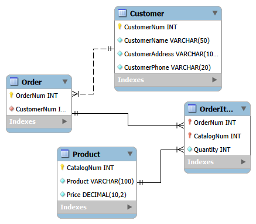
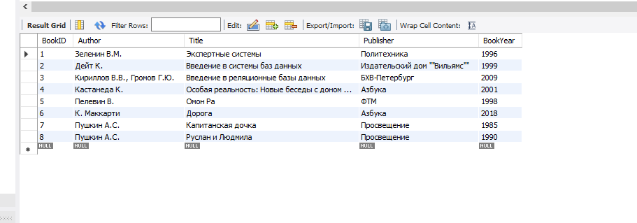

# Самостоятельная работа 4. Нормализация реляционных баз данных

## Инвариантная часть 4.1. Проектирование с учетом 3НФ

Исходная таблица имеет следующую структуру:
`CatalogNum`, `Product`, `Price`, `OrderNum`, `Quantity`, `CustomerNum`, `CustomerName`, `CustomerAddress`, `CustomerPhone`

Для приведения данной таблицы к 3НФ (третьей нормальной форме) необходимо избавиться от избыточности и транзитивных зависимостей. Для этого выделим сущности "Клиенты", "Товары", "Заказы" и "Позиции заказа".

### Отношение "Клиенты" (Customer)
Хранит информацию о заказчиках.
*   **CustomerNum** (Первичный ключ, INT)
*   **CustomerName** (VARCHAR, NOT NULL)
*   **CustomerAddress** (VARCHAR, NOT NULL)
*   **CustomerPhone** (VARCHAR, NOT NULL)

### Отношение "Товары" (Product)
Хранит информацию о товарах из каталога.
*   **CatalogNum** (Первичный ключ, INT)
*   **Product** (VARCHAR, NOT NULL)
*   **Price** (DECIMAL, NOT NULL)

### Отношение "Заказы" (Order)
Идентифицирует каждый уникальный заказ, сделанный клиентом.
*   **OrderNum** (Первичный ключ, INT)
*   **CustomerNum** (Внешний ключ к Customer.CustomerNum, INT, NOT NULL)

### Отношение "Позиции заказа" (OrderItem)
Связующая таблица для реализации отношения "многие-ко-многим" (один заказ может состоять из нескольких товаров, и один товар может быть в нескольких заказах).
*   **OrderNum** (Внешний ключ к Order.OrderNum, INT, NOT NULL)
*   **CatalogNum** (Внешний ключ к Product.CatalogNum, INT, NOT NULL)
*   **Quantity** (INT, NOT NULL)
*   *Первичный ключ составной:* `(OrderNum, CatalogNum)`

### Связи между отношениями:
1.  **Customer (1) — (М) Order**: Один клиент может сделать несколько заказов, но один заказ принадлежит только одному клиенту. Связь по ключу `CustomerNum`.
2.  **Order (1) — (М) OrderItem**: В одном заказе может быть несколько позиций товаров (строк заказа). Связь по ключу `OrderNum`.
3.  **Product (1) — (М) OrderItem**: Один товар может присутствовать в разных заказах. Связь по ключу `CatalogNum`.

**Схема базы данных:**


---

## Вариативная часть 4.1_1. Написание простых запросов на SQL

Ниже представлены SQL запросы согласно заданию. Особое внимание уделено отличиям в синтаксисе Microsoft Access и СУБД MySQL.

**Задание 1. Добавление книг одного автора**
```sql
INSERT INTO Book (Author, Title, Publisher, BookYear) VALUES ('Пушкин А.С.', 'Капитанская дочка', 'Просвещение', 1985);
INSERT INTO Book (Author, Title, Publisher, BookYear) VALUES ('Пушкин А.С.', 'Руслан и Людмила', 'Просвещение', 1990);
SELECT * FROM Book;
```


**Запрос 0_Все авторы_повторения**
```sql
SELECT Book.Author FROM Book;
```
.png)

**Запрос 1_Авторы без повторений**
```sql
SELECT DISTINCT Book.Author FROM Book;
```
.png)

**Запрос 2_Авторы без повторений сортировка 1**
```sql
SELECT DISTINCT Book.Author FROM Book ORDER BY Book.Author;
```
.png)

**Запрос 3_Авторы без повторений сортировка 2**
```sql
SELECT DISTINCT Book.Author, Book.BookYear 
FROM Book 
ORDER BY Book.Author ASC, Book.BookYear DESC;
```
.png)

**Запрос 4_Книги сортировка**
```sql
SELECT * FROM Book ORDER BY Book.BookYear ASC, Book.Title ASC;
```
.png)

**Запрос 5_Две последние книги**
*   **Нюанс СУБД:** В MS Access используется ключевое слово `TOP n` (например, `SELECT TOP 2 * FROM Book...`). В MySQL ключевое слово `TOP` не поддерживается, вместо него используется оператор `LIMIT`.
```sql
-- Вариант для MySQL:
SELECT * 
FROM Book
ORDER BY Book.BookYear DESC
LIMIT 2;
```
.png)

**Запрос 6_Половина списка**
*   **Нюанс СУБД:** В MS Access используется выражение `TOP 50 PERCENT`. В MySQL такой функции нет «из коробки», поэтому используется ограничение через `LIMIT` (предположим, что всего в базе 8 книг, тогда выводим 4).
```sql
-- Вариант для MySQL:
SELECT * 
FROM Book
ORDER BY Book.BookYear ASC
LIMIT 4; 
```
.png)

**Запрос 7_Запрос к связанным таблицам Inner**
```sql
SELECT BookInLib.LibID, Book.Author, Book.Title 
FROM Book INNER JOIN BookInLib 
ON Book.BookID = BookInLib.BookID;
```
.png)

**Запрос 8_Запрос к связанным таблицам Left**
```sql
SELECT BookInLib.LibID, Book.Author, Book.Title 
FROM Book LEFT JOIN BookInLib 
ON Book.BookID = BookInLib.BookID;
```
*Анализ результата:* В выборку попадут абсолютно все записи из левой таблицы (Book), даже если для них не нашлось соответствующих записей в правой таблице (BookInLib). Для таких книг столбец `LibID` будет содержать значение `NULL`.
.png)

**Запрос 9_книги с 1997 по 2001**
```sql
SELECT Book.Author, Book.Title, Book.Publisher, Book.BookYear 
FROM Book 
WHERE Book.BookYear BETWEEN 1997 AND 2001;
```
.png)

**Запрос 10_книги с 1997 по 2001 IN**
```sql
SELECT Book.Author, Book.Title, Book.Publisher, Book.BookYear 
FROM Book 
WHERE Book.BookYear BETWEEN 1997 AND 2001 AND Book.Publisher IN ('Азбука', 'Политехника');
```
.png)

**Запрос 11_книги с 1997 по 2001 OR**
```sql
SELECT Book.Author, Book.Title, Book.Publisher, Book.BookYear 
FROM Book 
WHERE Book.BookYear BETWEEN 1997 AND 2001 AND (Book.Publisher = 'Азбука' OR Book.Publisher = 'Политехника');
```
.png)

**Запрос 12_Авторы Like**
*   **Нюанс СУБД:** В MS Access символом подстановки для любой последовательности символов является `*`. В стандарте SQL и MySQL для этого используется символ `%`.
```sql
-- Вариант для MySQL:
SELECT *
FROM Book
WHERE Book.BookYear > 1999 
  AND (Book.Author LIKE 'Г%' OR Book.Publisher LIKE '%а')
ORDER BY Book.Title DESC;
```
.png)

**Разбор запроса (Задание 4. Опишите, что делает запрос)**
Исходный запрос из Access: `SELECT * FROM Book WHERE Author LIKE 'А*' OR BookYear> 2000 AND NOT Publisher LIKE '[И,П]*';`
*   **Описание действий:** Запрос выводит всю информацию о книгах, у которых фамилия автора начинается на букву «А», **ИЛИ** книги, изданные после 2000 года, название издательства которых **НЕ** начинается на буквы «И» или «П».
*   **Нюанс СУБД:** В MS Access `[И,П]*` задает регулярное выражение для символов. В MySQL для этого используется оператор `REGEXP` или `LIKE` с объединением `AND`.
```sql
-- Эквивалент для MySQL:
SELECT * 
FROM Book 
WHERE Author LIKE 'А%' 
   OR (BookYear > 2000 AND Publisher NOT REGEXP '^[ИП]');
```
.png)
